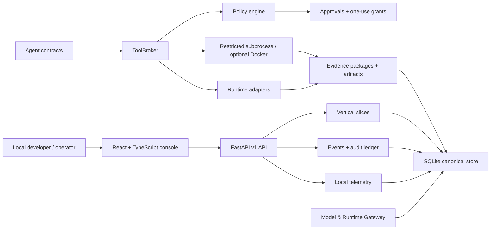

# AIDO Local Control Center

[](LICENSE)
[](pyproject.toml)
[](.nvmrc)
[](package.json)
[](docs/backend.md)
[](docs/frontend.md)
[](scripts/quality-local.ps1)
[](docs/security-policy.md)

AIDO is a local-first control plane for AI-assisted software development. It
coordinates projects, workflows, isolated workspaces, agent runtimes, model
routing, policy decisions, approvals, QA evidence, cost records, telemetry, and
audit events from a native local app.

It is not a chat clone and it is not an autonomous free-for-all. AIDO's core
design principle is simple: no agent, model, CLI, or tool call is allowed to
claim productive work unless the control plane can prove execution, workspace
containment, policy approval, QA evidence, and artifact integrity.

**Suggested GitHub topics:** `ai-agents`, `local-first`, `developer-tools`,
`fastapi`, `react`, `typescript`, `sqlite`, `model-gateway`, `policy-engine`,
`evidence-ledger`, `workflow-automation`, `software-supply-chain`,
`open-source-ai`, `windows-first`, `pnpm`, `uv`.

## Why AIDO Exists

Modern coding agents are powerful, but most workflows still hide the hard
questions:

- Which runtime actually executed the task?
- Was the work isolated from the main working tree?
- Did policy approve the tool call, or did an adapter bypass it?
- Which tests, artifacts, diffs, and hashes prove the result?
- Which model/provider was used, with what budget and quota posture?
- Which risks, approvals, and architecture decisions were created along the way?

AIDO turns those questions into first-class local state. The goal is to make
AI-assisted engineering auditable enough for serious local development, not to
pretend unavailable providers or skipped QA are successful automation.

## Current Maturity

| Area | Status |
| --- | --- |
| Backend | Python/FastAPI with SQLite as the canonical local store. |
| Frontend | Vite + React + TypeScript console served by the backend after build. |
| Runtime target | Native process on Windows, Linux and macOS. Docker is optional. |
| Package managers | PNPM through Corepack for JavaScript, `uv` for Python. |
| License | MIT. Core dependencies remain OSI-compatible or isolated as optional adapters. |
| CI posture | No GitHub quality workflow by policy. Quality gates are local/release-runner commands. |
| Default safety | Real remote provider calls and CLI productive execution are disabled until explicitly configured. |

## Feature Inventory

### Local Control Plane

- FastAPI v1 API composition through vertical slices.
- SQLite operational store with additive migrations.
- Loopback write token from `GET /api/v1/security/handshake`.
- Dashboard overview, event stream, audit records, telemetry, and health
  endpoints.
- Local-first telemetry for HTTP requests, policy decisions, tool calls, model
  calls, and agent-run completion.
- Optional OTLP/HTTP OpenTelemetry export when explicitly configured.

### Operator Console

The active console is an operational React app, not a marketing shell.

- Overview
- Active Projects
- Command Center
- Workflows
- Jobs & Approvals
- Agents
- Workspaces
- Policy & Security
- Memory & Retrieval
- Evidence & QA
- Runtime & Model Gateway
- Governance
- Integrations
- Audit Log
- Settings
- Command palette and keyboard shortcuts for approvals, events, and workflows
- Runtime-editable bilingual catalog with English and Spanish defaults

The frontend consumes generated OpenAPI operation contracts. It must render
backend truth directly instead of inventing ready states, provider availability,
policy outcomes, or successful completion.

### Projects And Workspaces

- Project catalog, templates, providers, teams, and catalog agents.
- Project discovery for common repository manifests.
- Native local directory selection endpoint.
- One active workspace per `projectId + taskId`.
- Git worktree allocation when the source project is a Git repository.
- Safe directory fallback for non-Git projects with explicit degraded metadata.
- Workspace archive lifecycle with snapshot evidence captured before cleanup.
- Optional devcontainer metadata storage without requiring Docker.

### Workflows

- Workflow definitions, runs, steps, edges, and events.
- Workflow create/list/get/start/pause/resume/cancel endpoints.
- Explicit gate advancement for controlled workflow steps.
- `issue_to_patch` real-runtime workflow with fail-closed completion rules.
- PR/release/retro control gates that create auditable review, release, and
  governance checkpoints without deploying or mutating protected branches.
- Workflow detail views that link runs, workspaces, jobs, agent runs, policy
  decisions, evidence packages, artifacts, and approvals.

### Agents

AIDO models agents as contracts, not personalities.

- Agent profiles with role, runtime mode, tools, skills, permission profile,
  provider constraints, runtime constraints, budgets, and quality gates.
- Agent runs, tool-call trace records, model-call records, and usage ledger.
- Versionable skills loaded from local `SKILL.md` files.
- DeveloperAgent for real implementation work through executable CLI/model
  runtimes and structured patch application.
- QAAgent for brokered command verification from real exit codes and artifacts.
- DevOpsAgent for deterministic config scans and low-risk validation commands.
- SecurityAgent for deterministic security review, secret/path/command checks,
  and optional secondary model analysis.
- ArchitectAgent for evidence-grounded architecture review through a configured
  model runtime.

### Runtime And Model Gateway

- Runtime provider truth from `GET /api/v1/runtime/providers`.
- Safe configuration read model from
  `GET /api/v1/runtime/provider-configuration`.
- Provider accounts without raw secret persistence.
- Model catalog, provider health, model discovery, pricing snapshots, budgets,
  provider limits, quota state, routing profiles, role policies, route preview,
  route execution gates, usage ledger, routing decisions, benchmarks, and CLI
  sessions.
- API provider modes for OpenAI-compatible providers, OpenRouter, NVIDIA NIM,
  LiteLLM-style gateways, and similar OpenAI-compatible endpoints.
- Local Ollama support through the Ollama HTTP API.
- CLI runtime status for Codex CLI, Claude Code CLI, OpenHands, and SWE-agent
  adapter boundaries.
- Manual provider state for human/operator paths.

Provider state is intentionally strict:

- `configured` means required local/env/account configuration exists.
- `detected` means a safe local/remote detection check found the provider.
- `available` means health or detection is currently usable.
- `executable` means the provider can perform productive work through policy,
  an isolated workspace, supported capability, and evidence capture.

Configured is not executable. A seeded catalog row is not readiness.

### Policy, Approvals, And Sandboxing

- Deterministic policy decisions: `allow`, `requires_approval`,
  `requires_human`, and `deny`.
- Permission profiles for `plan`, `dev_safe`, `qa`, and `release`.
- Argument-level command classification and allowlists.
- ToolBroker boundary for shell, model, MCP, Docker, runtime, and patch actions.
- Structured `argv` execution only; command strings and `shell=True` are not
  product execution fallbacks.
- Workspace-aware path containment.
- One-use permission grants scoped to project, job, action, agent, tool,
  command, argv, workspace, runtime, and path.
- Approval/rejection/revocation APIs with required human reason.
- Restricted subprocess sandbox for low-risk allowlisted commands.
- Optional Docker sandbox profiles with catalog image, network, CPU, memory,
  timeout, revocation, and policy revision records.
- Productive truth scanner that blocks mock/fake/dummy/internal mock runtime
  leakage in product code.

### Evidence And QA

- Evidence package ledger with normalized test results and artifact rows.
- Artifact kinds for files, screenshots, reports, patches, status, logs,
  security findings, manifests, model calls, and workspace snapshots.
- SHA-256 hashes, artifact IDs, package ownership, root confinement, and token
  protected downloads.
- QA verdicts that cannot be marked passed without evidence signals.
- `issue_to_patch` evidence for runtime health, Git status, diffs, QA output,
  policy/security findings, model calls, and hashes.
- Large logs, screenshots, and patches promoted to artifact files instead of
  unbounded SQLite payloads.
- Evidence report export as local Markdown.
- Artifact cleanup dry-run/delete for orphan files.
- Governance-first artifact retention review for referenced evidence.

### Memory, Retrieval, And Prompts

- Local memory metadata in SQLite.
- Rebuildable NumPy retrieval index by default.
- Optional FAISS index through the `faiss` extra.
- Retrieval status, reindex, and search APIs.
- Prompt templates and append-only prompt version records.

### Governance

- Architecture decision records with status, context, decision, consequences,
  linked risks, and linked next steps.
- Risk register with severity, status, mitigation rules, and audit events.
- Prioritized next steps linked to risks or decisions.
- Automatic risk creation from policy-gated actions, failed/blocked QA, and
  cancelled workflows.
- Dashboard filters and strict risk status updates.

### Integrations

- IDE connection records.
- MCP server registry and MCP tool-call records.
- Open Design status surface.
- Optional OpenHands and SWE-agent adapter status without making those runtimes
  core dependencies.
- Runtime adapter smoke scripts for local and release validation profiles.

## What AIDO Is Not

- Not a hosted multi-tenant SaaS.
- Not a production deployment platform.
- Not a generic chat UI.
- Not a runtime that silently executes arbitrary shell commands.
- Not dependent on WSL or Docker for normal startup.
- Not a system that treats missing credentials, missing CLIs, unavailable
  providers, empty diffs, skipped QA, or pending approvals as completed work.
- Not a repository that claims GitHub CI is green when the quality policy is
  local/release-runner based.

## Quick Start

### Prerequisites

- Git
- Python 3.11+
- [`uv`](https://docs.astral.sh/uv/)
- Node >=24.16.0 <25.0.0
- Corepack, bundled with supported Node releases
- PowerShell on Windows
- Optional for full local quality: Gitleaks and Semgrep CLIs

On Windows, install `nvm-windows` if you want the installer to select the exact
Node version from `.nvmrc`. Without `nvm`, the installer uses the current
`node` on `PATH`; release-grade checks should still use Node >=24.16.0 <25.0.0.

### One-Command Install

Windows PowerShell:

```powershell
powershell -NoProfile -ExecutionPolicy Bypass -File scripts/install-local.ps1
```

Linux/macOS shell:

```bash
bash scripts/install-local.sh
```

Optional FAISS index support:

```powershell
powershell -NoProfile -ExecutionPolicy Bypass -File scripts/install-local.ps1 -WithFaiss
```

```bash
bash scripts/install-local.sh --with-faiss
```

The installer performs the local dependency setup:

- selects the repository Node runtime when the platform helper can do it;
- installs JavaScript dependencies with `corepack pnpm@10.24.0 install`;
- creates/syncs the Python environment with `uv sync --extra dev --extra test`;
- optionally adds `--extra faiss`;
- installs Playwright browsers for web smoke tests.

### Manual Setup

Use this path when you want every step explicit.

Windows PowerShell:

```powershell
powershell -NoProfile -ExecutionPolicy Bypass -File local-control-center/scripts/use-node.ps1
corepack pnpm@10.24.0 install
uv sync --extra dev --extra test
corepack pnpm@10.24.0 exec playwright install
```

Linux/macOS shell:

```bash
nvm install 24.16.0
nvm use 24.16.0
corepack pnpm@10.24.0 install
uv sync --extra dev --extra test
corepack pnpm@10.24.0 exec playwright install
```

## Run Locally

Start the backend and dashboard:

```powershell
corepack pnpm@10.24.0 run start
```

Direct native launcher:

```powershell
uv run python local-control-center/scripts/start_control_center.py --dashboard-host 127.0.0.1 --dashboard-port 4310
```

Default dashboard URL:

```text
http://127.0.0.1:4310
```

Direct backend startup:

```powershell
uv run python -m local_control_center --dashboard-host 127.0.0.1 --dashboard-port 4310
```

Windows native wrapper:

```powershell
corepack pnpm@10.24.0 run start:windows
```

Stop the app with `Ctrl+C` in the owning terminal.

## Configure Real Providers

Real provider calls and CLI productive execution are disabled by default. Set
environment variables before startup, then inspect the configuration and runtime
truth endpoints.

```powershell
$env:AIDO_ENABLE_REAL_PROVIDER_CALLS = "true"
$env:AIDO_ENABLE_CLI_RUNTIMES = "true"
```

OpenAI-compatible provider:

```powershell
$env:AIDO_OPENAI_COMPATIBLE_BASE_URL = "https://provider.example/v1"
$env:AIDO_OPENAI_COMPATIBLE_API_KEY = "<real API key outside repo>"
$env:AIDO_OPENAI_COMPATIBLE_MODEL = "provider/model"
```

OpenRouter:

```powershell
$env:AIDO_OPENROUTER_API_KEY = "<real API key outside repo>"
$env:AIDO_OPENROUTER_MODEL = "provider/model"
```

NVIDIA NIM / Build:

```powershell
$env:AIDO_NVIDIA_API_KEY = "<real API key outside repo>"
$env:AIDO_NVIDIA_BASE_URL = "https://integrate.api.nvidia.com/v1"
$env:AIDO_NVIDIA_MODEL = "provider/model"
```

Anthropic API:

```powershell
$env:AIDO_ANTHROPIC_API_KEY = "<real API key outside repo>"
$env:AIDO_ANTHROPIC_MODEL = "claude-model-id"
```

Ollama:

```powershell
$env:AIDO_OLLAMA_BASE_URL = "http://127.0.0.1:11434"
```

CLI runtimes:

```powershell
$env:AIDO_CODEX_COMMAND = "codex"
$env:AIDO_CLAUDE_COMMAND = "claude"
```

Never commit `.env` files, raw provider keys, local SQLite databases, generated
artifacts, or workspace snapshots. For real provider keys, prefer
OpenBao/Vault-compatible `credentialRef` values documented in
[docs/credentials.md](docs/credentials.md).

## Run A Real `issue_to_patch` Workflow

1. Start AIDO.
2. Fetch the loopback token.
3. Verify an executable runtime exists.
4. Submit a concrete issue with QA commands.

```powershell
$base = "http://127.0.0.1:4310"
$token = (Invoke-RestMethod "$base/api/v1/security/handshake").token

Invoke-RestMethod "$base/api/v1/runtime/providers" |
  Select-Object -ExpandProperty providers |
  Select-Object id, configured, available, executable, capabilities, reason

$body = @{
  projectId = "<existing-project-id>"
  title = "Fix the failing behavior"
  issueText = "Concrete issue description and acceptance criteria."
  preferredRuntime = "codex_cli"
  qaCommands = @(
    @("uv", "run", "pytest", "tests_py", "-q")
  )
  requireApproval = $true
} | ConvertTo-Json -Depth 8

Invoke-RestMethod "$base/api/v1/workflows/issue-to-patch" `
  -Method Post `
  -Headers @{ "X-AIDO-Token" = $token } `
  -ContentType "application/json" `
  -Body $body
```

The project path must be a Git repository for productive CLI completion. If
runtime configuration is missing, a CLI is not installed, health checks fail,
QA is absent, policy blocks execution, the diff is empty, or approval is still
required, the workflow returns a blocked/review/unavailable state with a
technical reason. It does not simulate success.

When the workflow returns `evidence_ready` with a
`workflow.issue_to_patch.approve_patch` action request, first approve that
action request with a human reason, then transition the workflow run:

```powershell
Invoke-RestMethod "$base/api/v1/workflows/issue-to-patch/<workflow-run-id>/approve" `
  -Method Post `
  -Headers @{ "X-AIDO-Token" = $token } `
  -ContentType "application/json" `
  -Body (@{ reason = "Patch reviewed; QA/evidence accepted for integration." } | ConvertTo-Json)
```

This sets the workflow run to `approved_for_integration` and the linked job and
agent run to `approved`. It does not mark the work `completed`; PR creation,
branch promotion, and release gates remain explicit later steps.

After approval, promote the verified patch to a local branch and rerun QA:

```powershell
Invoke-RestMethod "$base/api/v1/workflows/issue-to-patch/<workflow-run-id>/promote" `
  -Method Post `
  -Headers @{ "X-AIDO-Token" = $token } `
  -ContentType "application/json" `
  -Body (@{
    reason = "Promote approved patch to an auditable local branch."
    branchName = "aido/promote/example"
  } | ConvertTo-Json)
```

GitHub PR creation is optional and is not required for startup. Configure it
only when needed:

```powershell
$env:AIDO_GITHUB_TOKEN = "<token>"
$env:AIDO_GITHUB_REMOTE = "owner/repo"

Invoke-RestMethod "$base/api/v1/workflows/issue-to-patch/<workflow-run-id>/pull-request" `
  -Method Post `
  -Headers @{ "X-AIDO-Token" = $token } `
  -ContentType "application/json" `
  -Body (@{
    reason = "Open PR after approved evidence, promotion QA, and audit review."
    baseBranch = "main"
  } | ConvertTo-Json)
```

If GitHub config is missing the command returns `pr_unavailable`. If GitHub
rejects the request it returns `pr_failed` with evidence; no PR URL is
fabricated.

## Common Commands

```powershell
corepack pnpm@10.24.0 run start
corepack pnpm@10.24.0 run build:control-center
corepack pnpm@10.24.0 run openapi:generate
corepack pnpm@10.24.0 run typecheck:web
corepack pnpm@10.24.0 run test:py
corepack pnpm@10.24.0 run test:web
corepack pnpm@10.24.0 run lint:py
corepack pnpm@10.24.0 run security:secrets
corepack pnpm@10.24.0 run security:sast
corepack pnpm@10.24.0 run smoke:runtime:preflight
corepack pnpm@10.24.0 run quality
```

`quality` runs `scripts/quality-local.ps1` and includes:

- productive truth scan;
- Python tests;
- Playwright web tests;
- frontend production build;
- web typecheck when declared;
- lint when declared;
- architecture guardrails;
- Gitleaks secret scan;
- Semgrep SAST.

`test:all` is faster and narrower: web typecheck, frontend build, and Python
tests. Use `quality` before release-grade local evidence.

## Architecture



Core rule:

```text
agent run -> ToolBroker -> PolicyEngine -> Approval/Grant -> RuntimeAdapter/Sandbox -> Evidence
```

Direct subprocess execution, runtime adapter bypasses, command strings, and
unscoped workspace writes are outside the product contract.

## Repository Layout

```text
local_control_center/
  api.py                         FastAPI app composition
  control_plane/                 runtime bootstrap and overview read model
  shared/                        DB, migrations, events, telemetry, redaction
  projects/                      project catalog and discovery
  workspaces_projects/           workspaces, Git worktrees, archive lifecycle
  workflows/                     workflow records and issue_to_patch runner
  jobs_approvals/                jobs, action requests, approvals, grants
  security_policy/               policy, command classification, sandbox gates
  agents/                        agent contracts, model gateway, runtime status
  evidence/                      evidence packages, artifacts, QA verdicts
  governance/                    ADRs, risks, next steps
  memory_retrieval/              memory and retrieval indexes
  integrations/                  IDE, MCP, Open Design, optional adapters
  prompts/                       prompt templates and versions

local-control-center/
  web/                           Vite + React + TypeScript console
  scripts/                       native local operation scripts

scripts/                         repository-level install and quality scripts
tests_py/                        Python contract, policy, architecture tests
tests_web/                       Playwright dashboard tests
docs/                            maintained technical documentation
```

## API Surface

High-signal v1 endpoints:

- `GET /healthz`
- `GET /api/v1/security/handshake`
- `GET /api/v1/overview`
- `GET /api/v1/events`
- `GET /api/v1/telemetry/status`
- `GET/POST /api/v1/projects`
- `POST /api/v1/projects/discover`
- `GET/POST /api/v1/workflows`
- `POST /api/v1/workflows/issue-to-patch`
- `POST /api/v1/workflows/issue-to-patch/{run_id}/approve`
- `GET/POST /api/v1/jobs`
- `GET /api/v1/approvals`
- `GET/POST /api/v1/workspaces`
- `POST /api/v1/workspaces/{id}/archive`
- `GET/POST /api/v1/evidence`
- `GET /api/v1/evidence/{id}`
- `GET /api/v1/evidence/{id}/report`
- `GET /api/v1/runtime/providers`
- `GET /api/v1/runtime/provider-configuration`
- `GET /api/v1/model-gateway/overview`
- `GET/POST/PATCH /api/v1/model-gateway/providers`
- `GET/POST/PATCH /api/v1/model-gateway/models`
- `POST /api/v1/model-gateway/route/preview`
- `POST /api/v1/model-gateway/route/execute`
- `GET /api/v1/model-gateway/usage-ledger`
- `GET/POST/PATCH /api/v1/model-gateway/budget-rules`
- `GET/PATCH /api/v1/model-gateway/provider-limits`
- `GET/POST /api/v1/agent-profiles`
- `POST /api/v1/agents/developer/runs`
- `POST /api/v1/agents/qa/runs`
- `POST /api/v1/agents/devops/runs`
- `POST /api/v1/agents/security/runs`
- `POST /api/v1/agents/architect/runs`
- `GET/PUT /api/v1/i18n/catalog`
- `GET/POST /api/v1/memory`
- `POST /api/v1/retrieval/search`
- `POST /api/v1/retrieval/reindex`
- `GET /api/v1/governance`
- `GET/POST /api/v1/architecture-decisions`
- `GET/POST /api/v1/risks`
- `PATCH /api/v1/risks/{id}`
- `POST /api/v1/integrations/mcp/register`

The generated frontend client lives at
`local-control-center/web/src/api/generated/openapi.ts` and is refreshed with:

```powershell
corepack pnpm@10.24.0 run openapi:generate
```

## Security Model

AIDO is local-first, but local does not mean trusted-by-default.

- Mutating API calls require the loopback token.
- Productive tool execution requires policy evaluation.
- Sensitive actions require explicit human approval and a scoped one-use grant.
- Runtime providers must prove configuration, health, capability, and
  executable state.
- Secrets are redacted before operational persistence.
- Raw provider keys are not stored in SQLite.
- Artifact reads are token-protected, package-owned, root-confined, and
  hash-verified.
- Docker is optional and profile-gated.
- Unknown package scripts, installs, networked execution, production deploys,
  force pushes, privilege escalation, recursive deletes, and dangerous runtime
  flags are not low-risk actions.

See [SECURITY.md](SECURITY.md), [docs/security-policy.md](docs/security-policy.md),
and [docs/credentials.md](docs/credentials.md).

## Contributing

Contributions are welcome when they strengthen the real control-plane contract.
The best contributions are small, testable, and explicit about the behavior
they change.

Before opening a pull request:

1. Install dependencies with the simple installer.
2. Keep changes scoped to one behavior or architectural boundary.
3. Add or update tests for behavior changes.
4. Regenerate OpenAPI client output after backend schema changes.
5. Run the relevant focused checks.
6. Run `corepack pnpm@10.24.0 run quality` for release-grade local evidence.
7. Do not commit secrets, `.env`, local databases, generated runtime artifacts,
   dependency folders, prompt dumps, or private workspace snapshots.

Useful starting areas:

- improve typed frontend DTO coverage where stable rows still have flexible
  extension metadata;
- add focused tests around workflow and evidence edge cases;
- improve model/runtime gateway UX without weakening fail-closed semantics;
- expand docs for optional runtime adapters with real installation evidence;
- improve accessibility and density of operational dashboard surfaces;
- add release-runner evidence recipes for optional OpenHands/SWE-agent smokes.

See [CONTRIBUTING.md](CONTRIBUTING.md) and the PR template under
[.github/PULL_REQUEST_TEMPLATE.md](.github/PULL_REQUEST_TEMPLATE.md).

## Documentation Map

- [Architecture](docs/architecture.md)
- [Project map](docs/project-map.md)
- [Backend](docs/backend.md)
- [Frontend](docs/frontend.md)
- [Workflows](docs/workflows.md)
- [Workspaces](docs/workspaces.md)
- [Agents](docs/agents.md)
- [Runtime providers](docs/runtime-providers.md)
- [Model gateway](docs/model-gateway.md)
- [Model routing](docs/model-routing.md)
- [Budget and quota control](docs/budget-and-quota-control.md)
- [Provider accounts](docs/provider-accounts.md)
- [Credentials](docs/credentials.md)
- [Evidence and QA](docs/evidence.md)
- [Security policy](docs/security-policy.md)
- [Governance](docs/governance.md)
- [Development](docs/development.md)
- [License audit](docs/license-audit.md)
- [Roadmap](docs/roadmap.md)

## License

AIDO is released under the [MIT License](LICENSE). See
[NOTICE](NOTICE) and [THIRD_PARTY_NOTICES.md](THIRD_PARTY_NOTICES.md) for
project and third-party notices.
