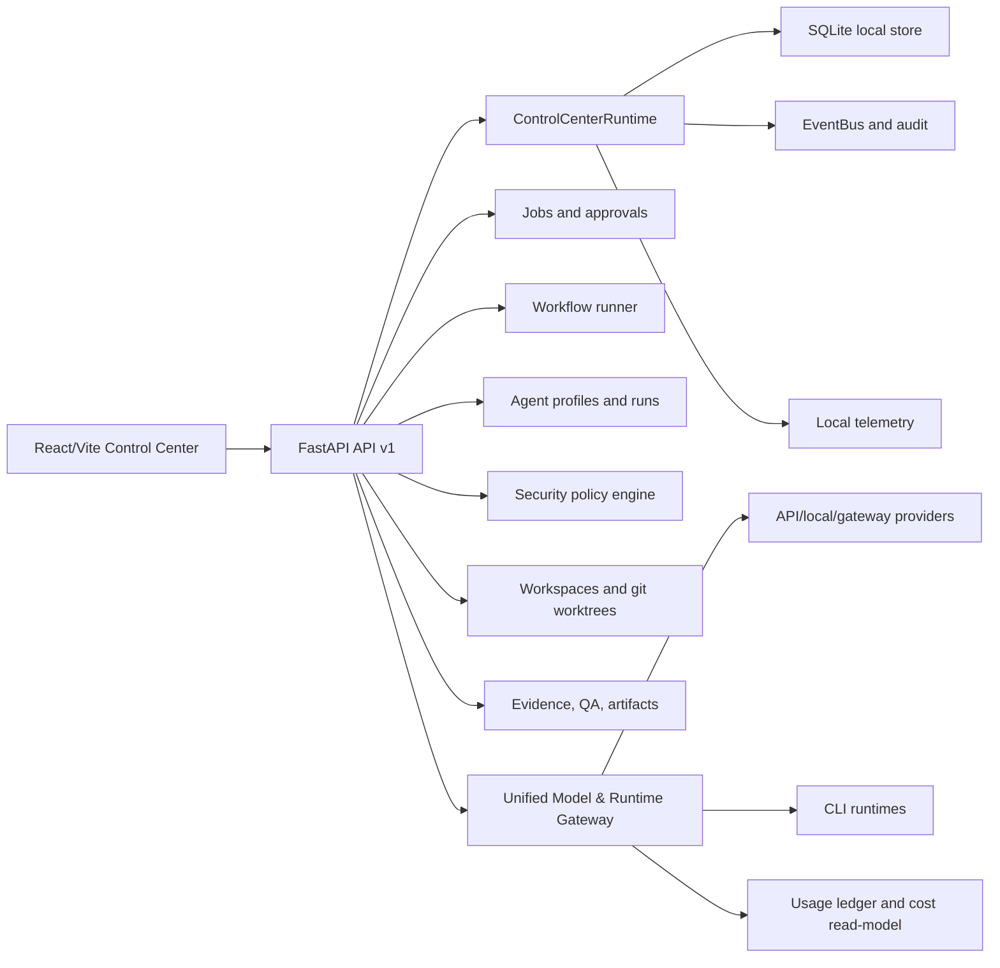
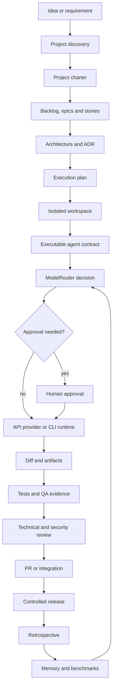
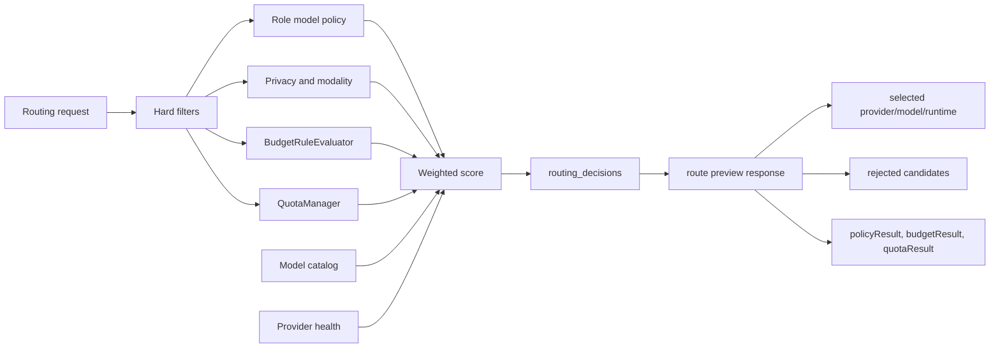
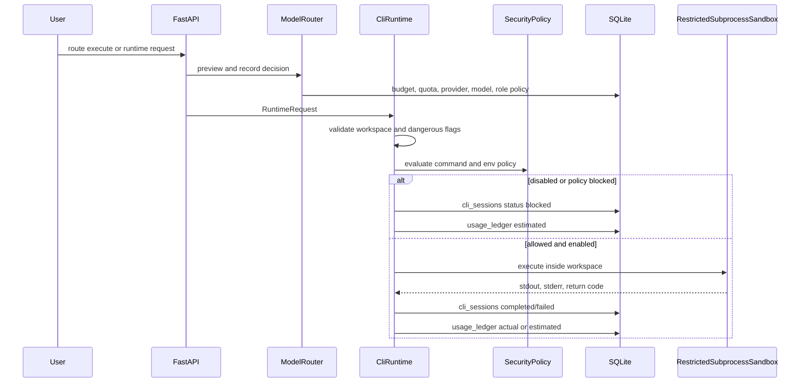

# AIDO Architecture Diagrams

## Diagrama 1 - arquitectura actual

The current architecture is already a local-first control plane with API,
policy, workflow, evidence, workspace and gateway slices.

## Diagrama 2 - arquitectura objetivo

The target is not an agent chat room. It is an SDLC control plane that routes
work through contracts, policies, budgets, quotas, evidence and audit.

## Diagrama 3 - decision de modelo/runtime

The router first applies hard filters and only then scores candidates. The
default mode remains `balanced_best_value`, not `max_performance`.

## Diagrama 4 - ejecucion segura CLI

Real CLI execution is fail-closed by default. Mock execution can persist session
and usage records without invoking external CLIs.
