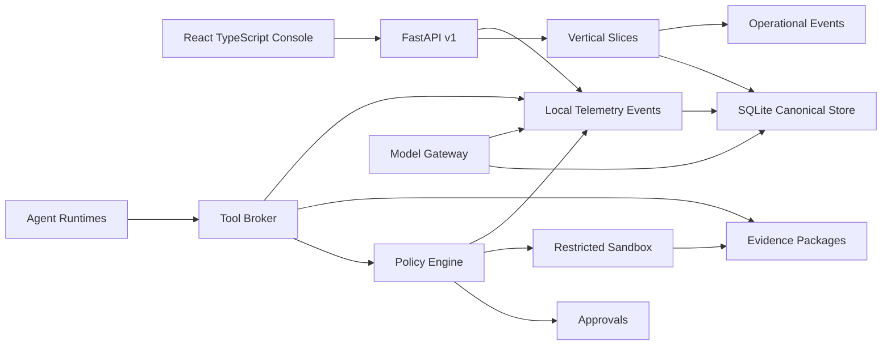

# Architecture

Local Control Center is a Windows-first Python/FastAPI control plane with a
React/TypeScript operational console. SQLite is the canonical local store.
Indexes, frontend bundles, caches, and generated artifacts are rebuildable.

## Core Decisions

- Backend business logic is Python-only.
- React remains the frontend toolchain and must consume FastAPI v1.
- No active legacy compatibility routes are part of the product.
- Agents are contracts with runtime modes, permission profiles, tools, skills,
  budgets, quality gates, and structured outputs.
- Tool calls are never executed directly by an agent adapter.
- Shell execution requires policy allow, structured `argv`, restricted sandbox,
  workspace containment, and persisted evidence.
- Workflow runs are connected to workspaces, jobs, agent runs, and evidence so
  the UI can audit an SDLC path from plan to execution.
- Model calls are mediated by the model gateway before provider-specific
  adapters such as LiteLLM, Ollama, OpenAI-compatible APIs, OpenHands, or SWE
  Agent are attached.
- Observability is local-first: requests, policy decisions, tool calls, model
  calls, and agent runs emit redacted operational telemetry events in SQLite.
  External OpenTelemetry exporters are optional OTLP/HTTP adapters and are
  disabled unless explicitly configured.

## Current Slice Map

- `projects`: project catalog and provider/team/agent catalog extraction.
- `workflows`: workflow definitions, runs, steps, edges, and events.
- `jobs_approvals`: queue, leases, runs, action requests, and approvals.
- `agents`: profiles, runs, model gateway, tool broker, runtime catalog, skills.
- `security_policy`: deterministic policy engine, argument-level command
  allowlists, permission decisions, restricted sandbox.
- `workspaces_projects`: isolated task workspaces and archive lifecycle.
- `evidence`: evidence packages, test results, QA verdicts, archive snapshots.
- `memory_retrieval`: SQLite memory plus NumPy/FAISS retrieval backends.
- `governance`: risks, ADRs, and actionable next steps.
- `integrations`: IDE connection records, MCP registry, and optional external
  runtime adapter status.
- `prompts`: prompt templates and version history.
- `control_plane`: overview read model for the UI.

## Remaining Architecture Work

- Continue slimming broad test setup around `tests_py/control_plane_fixture.py`
  by moving feature tests toward direct repository construction where that makes
  intent clearer. The product package no longer contains
  `local_control_center/store.py`, and the previous test store harness has been
  deleted.
- Keep expanding repository-level tests where broad fixture setup is still
  noisier than direct slice construction.
- Continue adding explicit Pydantic request/response models to high-traffic
  routes. Health, handshake, retrieval status, workflow mutations, agent
  profile upserts, model policy upserts, jobs/approvals mutations, and
  governance mutations now generate named OpenAPI DTOs. Workspace, integration,
  policy, evidence, session/chat, and larger overview subresources still need
  narrower schemas.
