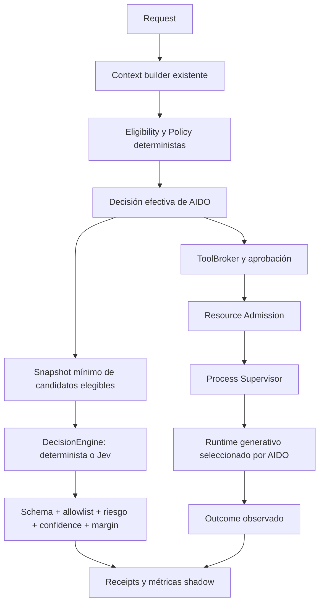

# Decision Engine: Jev y selección validada de runtimes

Fecha de verificación: 2026-09-20. Primera versión: `engineVersion=1`, esquema SQLite 74.

## 1. Executive summary

**Jev recomienda. AIDO autoriza.** El modo `shadow` conserva las decisiones existentes. Por solicitud explícita posterior se añadió `runtime_selection`: Jev elige exclusivamente entre candidatos validados por AIDO, sin preferencia fija de proveedor/modelo. AIDO conserva políticas, costos, aprobación, Resource Admission y ejecución. El default de instalación sigue siendo `enabled=true`, `mode=shadow`; la activación de selección se persiste mediante Settings. `advisory` y `autonomous` no son valores aceptados.

### Selección activa solicitada el 20 de septiembre

- `decision_engine.mode=runtime_selection` ignora preferencias de proveedor/modelo al seleccionar. No reutiliza el scorer clásico como fallback. Un error, timeout, baja confianza o ausencia de candidatos conserva `selected=None` con motivo explícito.
- Sólo admite catálogo habilitado, políticas/capacidades/costos permitidos, runtime ejecutable con salud menor a 5 minutos y una ejecución satisfactoria específica del modelo menor a 24 horas. Un HTTP 404/410 posterior, cambio de configuración o deshabilitación invalida esa evidencia. GET `/models` no acredita una inferencia.
- La evidencia proviene de ejecuciones reales o de la prueba de modelo autorizada por el operador. No se hacen pruebas pagadas automáticas ni se inventa/backfillea una validación histórica.
- Se revalida después de Jev y al consumir la decisión en el broker. Los receipts activos no se incluyen en la métrica comparativa shadow, evitando acuerdo artificial del 100 %.
- Los previews no hacen inferencias, incluso si persisten un diagnóstico. La ejecución debe solicitar explícitamente ranking.
- El launcher carga la entrada Windows Vault `AIDO` / `Jev` al iniciar con selección activa. Usa el guard exclusivo `AIDO_ENABLE_JEV_CALLS`; no habilita proveedores generativos ni CLI. QA bloquea Jev aunque herede guard/clave. El guard global anterior sigue compatible fuera de QA.
- Rollback: volver a `mode=shadow` conserva la evidencia y restaura el comportamiento anterior; `enabled=false` desactiva el motor. El frontend anterior puede necesitar recarga para mostrar el nuevo valor de configuración.

Las secciones siguientes documentan el contrato original de observación; sus afirmaciones sobre conservar la selección determinista se aplican a `shadow`.

Se implementan cuatro contratos de decisión, providers determinista/Jev, validación central, fallback, breaker durable, configuración existente, receipts, outcomes y API de comparación offline. No se realizaron llamadas de pago ni se escribieron overrides en configuración de usuario/proyecto.

## 2. Architecture before

Arquitectura comprobada en el repositorio:

- `threads/coordinator.py` clasifica intención con `product_loop/intent_classifier.py`, crea el plan de equipo y persiste el intake dentro de una transacción.
- `product_loop/coordinator.py` solicita recursos para Product Owner y roles al `AIResourceManager`, y conserva sus decisiones de routing.
- `agents/ai_resource_manager.py` aplica política, elegibilidad, disponibilidad, capacidades y preferencias. Las selecciones rechazadas se registran aparte de `candidates`.
- `agents/tool_broker.py`, PolicyEngine, aprobaciones, Resource Admission y Process Supervisor autorizan/controlan efectos. Los adaptadores generativos ejecutan bajo esas fronteras.
- Settings dispone de registro, validación, precedencia proyecto/general/default, API autenticada y UI. SQLite usa migraciones incrementales y eventos durables; el aprendizaje de recursos recibe resultados posteriores.

Estos componentes siguen siendo autoridad. Se preservaron los cambios previos ajenos en routing/NVIDIA, discovery, remediations y sus pruebas; no se modificó la política de AIDO-57 para acomodar Jev.

## 3. Architecture after



Los hooks retornan `None` y no reasignan el resultado original. El intake observa después del commit; el endpoint de mensajes usa el threadpool de FastAPI para esperar la evaluación síncrona acotada sin bloquear el event loop. El contexto SQLite de la operación se conserva. Las rutas Product Owner/equipo observan después de la selección y de la aprobación determinista existente.

La evaluación es secuencial y esperada, sin tareas en segundo plano ni procesos nuevos. Desactivada, no hace llamadas ni crea receipts. Activada, cada decisión puede añadir hasta el timeout configurado más trabajo local; un intake puede realizar tres evaluaciones. No se sostiene una transacción SQLite durante HTTP.

## 4. Files changed

Archivos propios de esta integración (rutas relativas al repositorio):

| Archivo | Cambio |
| --- | --- |
| `local_control_center/decision_engine/__init__.py` | Nuevo módulo de dominio. |
| `local_control_center/decision_engine/models.py` | Contratos tipados, enums, fingerprints, riesgo monotónico. |
| `local_control_center/decision_engine/config.py` | Configuración y resolver existentes, shadow habilitado por defecto. |
| `local_control_center/decision_engine/providers.py` | Providers determinista/Jev, privacidad y validación HTTP/JSON. |
| `local_control_center/decision_engine/transport.py` | DNS cancelable y HTTPS con IP pública, Host/SNI originales. |
| `local_control_center/decision_engine/service.py` | Gate shadow, fallback, latencia y evidencia de cada intento. |
| `local_control_center/decision_engine/repository.py` | Receipts, outcomes y breaker, escrituras atómicas. |
| `local_control_center/decision_engine/observers.py` | Adaptación de decisiones reales y asociación de resultados. |
| `local_control_center/decision_engine/reporting.py` | Métricas y comparación offline con denominadores explícitos. |
| `local_control_center/decision_engine/api.py` | Lecturas locales de estado, receipts y reportes. |
| `local_control_center/api.py` | Registro del router de lectura. |
| `local_control_center/settings/registry.py` | 16 settings y validación específica. |
| `local_control_center/i18n/default_catalog.json` | Etiquetas de settings en español e inglés. |
| `local_control_center/shared/migrations.py` | Migración aditiva 74 e índices. |
| `local_control_center/threads/coordinator.py` | Observador de workflow, rol y escalación después del commit. |
| `local_control_center/threads/api.py` | Handler de mensajes síncrono en threadpool. |
| `local_control_center/product_loop/coordinator.py` | Hooks de routing y outcomes observados. |
| `pyproject.toml` | HTTPX como dependencia directa; dnspython 2.8.0 para DNS cancelable. |
| `uv.lock` | Lock consistente, sin actualización de paquetes existentes. |
| `tests_py/test_decision_engine.py` | Contratos, riesgo, gates, rollback, evidencia y latencia. |
| `tests_py/test_jev_provider.py` | Transporte, JSON estricto, privacidad, DNS y cancelación offline. |
| `tests_py/test_decision_engine_integration.py` | Selección real, ToolBroker, permisos, elegibilidad y outcomes. |
| `tests_py/test_decision_engine_api.py` | HTTP real de intake, settings, estado y rollback. |
| `docs/architecture/decision-engine.md` | Arquitectura, operación, resultados y límites. |

## 5. Decision contracts

`DecisionEngine.decide(DecisionRequest) -> DecisionResult` es asíncrono. Pydantic prohíbe campos desconocidos y valores no finitos. El gate revalida incluso resultados de proveedores inyectados.

| Tipo | Opciones y frontera |
| --- | --- |
| `runtime_model_ranking` | Sólo `decision.candidates` del selector real; nunca `rejected`. |
| `agent_role_selection` | Sólo roles presentes en el plan ya autorizado. No crea agentes. |
| `workflow_classification` | `bug`, `feature`, `research`, `architecture`, `review`, `security`, `unreal_asset`, `build`. |
| `escalation_decision` | `continue`, `deterministic_fallback`, `specialist_review`, `human_review`. No ejecuta la escalación. |

Request incluye contexto mínimo, candidatos, allowlist exacta, riesgo determinista, límite de costo opcional, decisión efectiva y correlaciones opcionales. Rechaza duplicados, discrepancias con la allowlist y selección efectiva inelegible. El costo máximo es evidencia contextual, no una autorización de gasto.

Result incluye selección, ranking, distribución completa, confidence, margin, engine/provider/model/version, tipo y códigos estructurados. El provider determinista proyecta la decisión existente y deja probabilidades/confidence en `null` o vacías: no inventa confianza.

Riesgo efectivo = máximo ordinal del riesgo determinista y la recomendación. `R0/R1 → low`, `R2 → medium`, `R3 → high`, `R4 → critical`; valores desconocidos fallan. Una respuesta de bajo riesgo no rebaja una restricción previa.

## 6. Jev integration

Se utiliza HTTPX contra `POST https://api.typesafe.ai/v1/systemone`, autenticación Bearer y modelo explícito `jev-1.13.0`. La versión probada por contrato es `1.13.0`; no se aceptan alias móviles. El adaptador rechaza otras versiones hasta revisar su contrato, aunque settings permite almacenar versiones explícitas para una actualización coordinada.

Payload: `model`, `state` con task type/risk enumerados y una pregunta `choice` con instrucciones constantes y criterios sanitizados. Las opciones son aliases `c0`, `c1`, etc. El mapping a IDs internos nunca sale de AIDO. Las descripciones de workflow/escalación son constantes locales. No se transmite la selección efectiva.

Respuesta requerida: modelo exacto, una única respuesta `decision` con `type=choice`, elección, probabilidades y confidence; usage con input/output tokens. Máximo 255 opciones y 64 KiB por payload/respuesta. Se rechazan JSON duplicado, campos extra, elección desconocida, distribución incompleta, NaN/Inf, negativos, suma fuera de tolerancia, ranking inválido y modelo diferente. No se renormalizan datos defectuosos.

Timeout total predeterminado 1 s, configurable entre 0,01 y 5 s. Sin retry, redirect, proxy del entorno ni descompresión de respuesta. DNS usa sockets asyncio de dnspython, servidores Do53 configurados como IP y validación de destino público. HTTP conecta a esa IP manteniendo `Host` y `sni_hostname=api.typesafe.ai`, con verificación TLS. No usa el executor de `getaddrinfo`; cancelar cierra el cliente y el socket DNS.

Se reutiliza `CredentialResolver`, limitado a `env:NOMBRE_VARIABLE`. Default `env:TYPESAFE_API_KEY`; la clave no se persiste en SQLite. Keyring se resuelve sólo al iniciar, fuera del deadline de inferencia. El proveedor requiere `AIDO_ENABLE_JEV_CALLS=true` o el guard global legacy `AIDO_ENABLE_REAL_PROVIDER_CALLS=true`; QA prevalece y bloquea ambos. En shadow la indisponibilidad conserva la decisión determinista; en selección activa bloquea sin fallback.

Fuentes oficiales consultadas el 2026-09-20: [API](https://docs.typesafe.ai/api), [modelos](https://docs.typesafe.ai/models), [choice](https://docs.typesafe.ai/primitives/choice), [confidence](https://docs.typesafe.ai/confidence), [limitaciones Jev 1.13](https://docs.typesafe.ai/model-jaggedness/jev-1.13), [HTTPX SNI](https://www.python-httpx.org/advanced/extensions/#sni_hostname), [resolver asíncrono dnspython](https://dnspython.readthedocs.io/en/stable/async-resolver-class.html). La compatibilidad HTTP está validada offline; conectividad/TLS e inferencia reales quedan `NOT_RUN`.

## 7. Trust boundaries

Jev puede proponer una opción de la lista recibida. No recibe herramientas, permisos ni referencias al broker, supervisor, repositorio de aprobaciones o cuotas. No decide shell, red, filesystem, sandbox, reservas, presupuesto ni ejecución. Los hooks no devuelven preferencias al llamador.

El gate exige confidence ≥ 0,85, margin ≥ 0,20 y riesgo ≤ medium para marcar `recommendation_usable`. Una recomendación de revisión humana/especialista puede superar ese riesgo sin reducirlo. Estos umbrales son política inicial, **no calibración empírica**. El margin es `p(top1) - p(top2)`; para una sola opción, top2=0. Se acepta empate de máximos, conservando la elección declarada y margin=0.

Confidence describe la concentración reportada por Jev, no probabilidad demostrada de corrección. Incluso una recomendación utilizable permanece shadow. En cualquier fallback se conserva la decisión efectiva de AIDO, incluyendo `None` cuando AIDO está bloqueado.

## 8. Shadow mode

Settings usa precedencia proyecto > general > default. Las 16 claves comienzan con `decision_engine.`:

| Sufijo | Default |
| --- | --- |
| `enabled` / `mode` / `provider` | `true` / `shadow` / `jev` |
| `shadow.enabled` / `jev.enabled` | `true` / `true` |
| `endpoint` | Endpoint oficial fijo |
| `api_key_reference` | `env:TYPESAFE_API_KEY` |
| `model` / `version` | `jev-1.13.0` / `1.13.0` |
| `timeout_seconds` | `1.0` |
| `confidence_threshold` / `margin_threshold` | `0.85` / `0.20` |
| `max_risk` / `probability_tolerance` | `medium` / `0.000001` |
| `circuit_failure_threshold` / `circuit_cooldown_seconds` | `3` / `30` |

Se editan mediante Settings existente y su autenticación, sin API paralela de configuración. Shadow se habilita por defecto; un override explícito `false` en general/proyecto sigue desactivándolo. Para llamadas reales: configurar la variable de entorno fuera del repositorio, mantener mode shadow y habilitar el guard de llamadas reales en el proceso. Esta entrega no configura claves ni modifica ese guard global.

`local_only`, forceLocal, remotos deshabilitados, candidato ausente, selección determinista bloqueada, transacción activa, credencial ausente, HTTP inválido y timeout provocan abstención/fallback. El breaker durable se identifica por fingerprint de configuración: abre por defecto tras tres fallos, espera 30 s y permite nuevos intentos; un éxito limpia el contador. No bloquea el runtime generativo. No incluye caché ni limitador de concurrencia de probes al expirar el cooldown.

### Guardar la clave en Windows

Para persistencia local, usar Windows Credential Manager mediante el backend `keyring.backends.Windows.WinVaultKeyring`, verificado en este entorno. Desde PowerShell, en la raíz de AIDO, ejecutar una vez y escribir la API key en el prompt oculto (no como argumento):

```powershell
.\.venv\Scripts\python.exe -m keyring -b keyring.backends.Windows.WinVaultKeyring set AIDO Jev
```

La clave queda en el almacén del usuario de Windows, fuera del repositorio y de SQLite. [Keyring documenta este backend y su CLI](https://keyring.readthedocs.io/en/stable/). No pegar la clave en Settings: `decision_engine.api_key_reference` debe conservar `env:TYPESAFE_API_KEY`.

Jev todavía no lee `keyring:` directamente dentro de su evaluación acotada. Este arranque recupera la clave **antes** de iniciar AIDO y la entrega sólo al entorno de ese proceso y sus hijos, sin imprimirla ni persistirla como variable de usuario/sistema. Detener primero la instancia anterior de AIDO por su mecanismo normal y ejecutar desde la raíz del repositorio:

```powershell
@'
import os
import runpy
from keyring.backends.Windows import WinVaultKeyring

key = WinVaultKeyring().get_password("AIDO", "Jev")
if not key:
    raise SystemExit("No existe la credencial AIDO/Jev en Windows Credential Manager.")
os.environ["TYPESAFE_API_KEY"] = key
os.environ["AIDO_ENABLE_REAL_PROVIDER_CALLS"] = "true"
del key
runpy.run_path("local-control-center/scripts/start_control_center.py", run_name="__main__")
'@ | .\.venv\Scripts\python.exe -
```

El guard `AIDO_ENABLE_REAL_PROVIDER_CALLS` es global: habilita la posibilidad de llamadas reales de AIDO, siempre sujetas a sus otras políticas. El almacén protege la persistencia, pero la clave debe existir en memoria/entorno durante el uso; no protege contra software malicioso ejecutándose bajo el mismo usuario. No usar `keyring get` sin captura porque muestra el secreto. No se guardó ni leyó ninguna clave real durante esta configuración.

## 9. Evidence

La migración 74 añade `decision_receipts`, `decision_outcomes` y `decision_provider_health`, sin alterar estados operacionales. Receipt `pending` se inserta antes del proveedor y se finaliza una vez mediante actualización condicional. Cancelación queda `cancelled`; un crash puede conservar `pending`, sin presentarlo como éxito.

Receipt contiene ID/timestamp, task fingerprint, tipo, versión de engine/model/provider, fingerprint de configuración, política aplicada, modo, candidatos/ranking/probabilidades, confidence/margin, riesgo, privacidad, decisión efectiva/recomendación, fallback/código, latencia y correlaciones disponibles (`projectId`, `jobId`, `agentRunId`, `executionId`, `sourceDecisionId`). No todos los hooks conocen todas las correlaciones: los valores ausentes son `null`.

Los eventos durables `decision_shadow_completed`/`decision_provider_failed` conservan un resumen estructurado sin cuerpo HTTP ni excepción externa. Un fallo de almacenamiento/configuración del observador deja diagnóstico `decision_evidence_failed`; la continuidad determinista se preserva y no se fabrica un receipt exitoso.

Outcome es separado e inmutable; sólo reintentar exactamente la misma observación es idempotente. Se enlaza al routing ID y almacena ejecución exitosa, duración, tokens/costo reales cuando la fuente los reporta. Tests, review, retries y override permanecen `null` salvo evidencia explícita. La inferencia de decisión tiene sus propios tokens y costo `null`: no hay tarifa verificada ni se inventa ahorro. Outcome generativo no se atribuye al contrafactual Jev.

API local de lectura:

- `GET /api/v1/decision-engine?projectId=...`: configuración segura y estado disabled/unknown/healthy/degraded/unavailable. Healthy requiere una recomendación realmente recibida, no un intento omitido.
- `GET /api/v1/decision-engine/decisions?projectId=...&after=0&limit=100`: receipts/outcomes por secuencia.
- `GET /api/v1/decision-engine/report?projectId=...&after=0&limit=1000`: comparación offline y métricas. No existe endpoint público que ejecute inferencia o escriba outcomes.

Métricas: conteo, errores/timeouts, fallback, agreement/disagreement, latencias, distribuciones confidence/margin, success/retry/override y fallos de tests/review. Cada tasa declara denominador; ausencia de observaciones es `null`. Ventana paginada explícita (máximo 1000), total global separado y fingerprints visibles. Agreement no es accuracy. `recommendationOutcome=not_observed`; calibración no se calcula sin ground truth etiquetado.

`routingLatencyMs` mide selección determinista, `latencyMs` evaluación/gate shadow y `totalRoutingLatencyMs` su suma cuando existe baseline. Son tiempos de decisión; excluyen persistencia inicial/final, preparación del observador, HTTP end-to-end del intake y ejecución generativa. No se extrapola throughput productivo desde fixtures.

## 10. Security

| Amenaza | Mitigación y evidencia |
| --- | --- |
| Prompt injection en mensajes/IDs | No enviar texto de usuario/código/rutas; enums y metadatos allowlisted, aliases opacos. |
| Candidato inventado o excluido por cuota/política | Snapshot posterior a elegibilidad, igualdad exacta con allowlist, selección original intacta. |
| Confianza alta en operación prohibida | Broker/política no consumen recomendaciones; prueba negativa conserva shell denegado. |
| Riesgo recomendado menor | Máximo ordinal obligatorio, tests R3→R1 conserva high. |
| Exfiltración de credenciales/PII | Env reference, payload mínimo, errores fijos, sin cuerpo de error ni logging de Authorization. |
| SSRF, redirects, DNS privado, proxy hostil | URL exacta, cero redirects/proxy, destino IP público, Host/SNI/TLS verificados. |
| Respuesta malformada o sobredimensionada | JSON/schema estricto, límites 64 KiB/255, números finitos, duplicados rechazados. |
| API caída o DNS lento | Timeout cancelable, cierre de sockets, breaker y fallback. |
| Replay de evidencia | IDs únicos y finalización condicional; outcome inmutable/idempotente. |

Los receipts locales sí contienen identificadores operacionales necesarios para auditoría; su protección usa la frontera local/API existente de AIDO. No son un almacén criptográfico ni una defensa contra un atacante con acceso de escritura a la DB. No se almacena razonamiento interno ni se solicita chain-of-thought.

## 11. Tests

Validaciones ejecutadas serialmente mediante `_run(QualityStep(...))` del runner existente, `QualityPaths`, DB de admisión real y workload `qa_light`, sin desactivar Resource Admission. Scratch bajo `%TEMP%/aido-quality`, evidencia retenida bajo `.tmp/jev-evidence`. Se usó `.venv/Scripts/python.exe` (Python 3.13.15).

Comando hijo focal exacto (lanzado por el runner):

```text
.venv/Scripts/python.exe -m pytest -q --tb=short --color=no tests_py/test_decision_engine.py tests_py/test_jev_provider.py tests_py/test_decision_engine_integration.py tests_py/test_decision_engine_api.py
```

**PASS: 104 tests, 24.40 s, exit 0.** Evidencia: `.tmp/jev-evidence/9986319e89084d9487b23187ae78b42e/` (JUnit `results.xml`). Incluye replay/rollback, umbrales/riesgo, malformed response, cancelación de DNS sin executor, cierre UDP, Host/SNI, bloqueo de IP privada, credenciales, intake HTTP real y estado healthy correcto.

La prueba crítica conserva Codex cuando Jev recomienda Claude y cruza el selector/ToolBroker/política reales, verificando argv de Codex. El proceso externo se sustituye por un sandbox fixture offline: no demuestra ejecución real de un modelo. La prueba de shell denegado verifica que el executor no es invocado. Las pruebas de timeout verifican que no aparecen jobs, tool calls, leases ni procesos nuevos.

TDD: se observaron fallos antes de corregir el intake HTTP, estado healthy y ausencia de latencia total. No se cambiaron assertions para ocultarlos. Los tests HTTP nuevos deshabilitan explícitamente el módulo opcional FAISS para evitar el crash nativo descrito abajo.

Verificación posterior al cambio solicitado de default a `enabled=true`: **169 PASS**, 112.66 s, exit 0, con FAISS opcional ausente. Incluye las cuatro suites focales anteriores y `test_threads_coordinator`, `test_thread_run_configuration`, `test_threads_api`, `test_request_scoped_database`, bajo el mismo runner/admisión. Evidencia: `.tmp/jev-evidence/0387625e97834fb2abbfb0e6e5a0e813/`. Lint, formato y diff: **PASS**. El ejemplo de arranque desde Credential Manager se validó offline con credencial sintética y ausencia de credencial; no se leyó el almacén real ni se inició AIDO durante la verificación.

## 12. Regressions

**PASS: 321 tests, 133.20 s, exit 0**, con FAISS opcional deshabilitado explícitamente. Evidencia: `.tmp/jev-evidence/5bfa255530ad448ab419eb0eda1bd9ad/`.

Suites: `test_ai_resource_manager`, `test_product_owner_runtime_resolution`, `test_runtime_quota_availability`, `test_runtime_failover`, `test_team_scheduler`, `test_intent_classifier`, `test_settings_slice`, `test_settings_audit_trail`, `test_threads_coordinator`, `test_thread_run_configuration`, `test_tool_broker_structured_argv`, `test_operational_recovery`, `test_i18n_platform`, `test_source_documentation_headers`, `test_real_readiness_architecture`, `test_internal_mock_product_boundary`, `test_execution_boundary_architecture`, `test_vertical_slices_architecture`, `test_web_rework_architecture` (todas bajo `tests_py/`, extensión `.py`).

Bootstrap exacto del hijo para estas regresiones, con argumento marcador `pytest` antes de las opciones y archivos anteriores:

```python
import sys
sys.modules['faiss'] = None
import pytest
sys.exit(pytest.main(sys.argv[2:]))
```

**FAIL del entorno nativo:** la corrida normal abortó durante colección por access violation en la carga nativa de FAISS, exit `3221225477`; no ejecutó esas regresiones. Evidencia: `.tmp/jev-evidence/85019e534834465e9d756013d8dd6b34/`. El PASS con FAISS ausente no valida su ruta nativa. No se modificó FAISS ni su configuración productiva.

Regresión adicional: **206 PASS, 2 FAIL**, 211.91 s, exit 1, en `tests_py/test_product_loop_coordinator.py`, `tests_py/test_request_scoped_database.py`, `tests_py/test_threads_api.py`; mismo bootstrap con FAISS ausente. Evidencia: `.tmp/jev-evidence/b441b99b16144ab58456d17ce9c47ba0/`.

Los dos fallos ocurren antes de ejecutar el coordinador, creando commits de fixtures: `test_run_user_message_blocks_empty_review_diff_with_review_remediation` y `test_run_user_message_blocks_when_review_diff_capture_crashes`. Diagnóstico focal reproducido (2 FAIL, 12.26 s): el hook global heredado de Git invoca gitleaks, que no logra crear su proceso Git hijo: `Not enough quota is available to process this command`. El hook clasifica ese error como secreto; no demuestra una fuga. El scan directo supervisado del mismo fixture pasó: 20 bytes, cero hallazgos. Evidencias: `.tmp/jev-evidence/9519cf04c0ae4dd8966e74e8d326451c/` y `.tmp/jev-evidence/f375d80fa87e45f09bccaef39ec00009/`. No se alteraron hooks, límites ni política para forzar estas pruebas; su validación queda **BLOCKED** por ese fallo de creación de procesos.

Ruff lint, formato de los Python propios, `uv lock --check --offline` y `git diff --check`: **PASS**. Revisión independiente: aprobada con observación sobre alcance de latencia, aclarada arriba. Suite completa de release, inferencia Jev real, TLS real y runtimes generativos reales: **NOT_RUN**. No se afirma aprobación de release.

## 13. Known limitations

- Es una integración de evidencia shadow, sin demostración de mejora de calidad, costo o productividad. Confidence no está calibrada en AIDO.
- Workflow observa metadatos derivados del clasificador existente; no lee el mensaje para una clasificación semántica independiente. Agreement aquí puede reflejar esa dependencia. Routing recibe task type `unknown` y atributos acotados; esto restringe la calidad de recomendaciones.
- Hooks limitados al intake de Threads y routing Product Owner/equipo de Product Loop. Preview/failover u otros callers directos del resource manager no se observan automáticamente.
- Evaluación síncrona secuencial: agrega latencia acotada por decisión; no existe cola asíncrona desacoplada. Un caller síncrono dentro de un event loop fuera del endpoint adaptado omite la observación y registra diagnóstico.
- Outcomes incompletos permanecen desconocidos; la primera observación no se puede enriquecer después. Antes de capturar review/tests tardíos se requerirá un contrato explícito de observaciones versionadas.
- Sin precios verificados, costo Jev y ahorro son desconocidos. No hay reserva de presupuesto dedicada a Jev: la activación futura de llamadas reales debe controlar volumen/costo operacionalmente.
- Sin endpoints custom, proxies corporativos, credenciales keyring, caché, promoción automática ni UI nueva especializada. La API y Settings existente exponen lo implementado.
- FAISS nativo bloquea validar esas rutas en este entorno; las regresiones reportadas usaron la modalidad opcional ausente. Una API/modelo remoto futuro puede cambiar el esquema: falla cerrado y requiere nueva validación.
- Dos regresiones de review permanecen sin validar porque el hook Git del fixture excede la cuota de creación de procesos al lanzar Git desde gitleaks. No se modificó AIDO-57 ni la política del host para ocultarlo.

## 14. Rollback

Cambiar `decision_engine.enabled=false` mediante Settings en el scope efectivo detiene nuevas evaluaciones/receipts y restaura la selección determinista. Verificar overrides de proyecto: un `true` explícito de proyecto prevalece sobre general `false`; desactivar también allí si corresponde. `mode=disabled` desactiva el motor; `shadow.enabled=false` sólo desactiva shadow, no la selección activa.

Rollback no requiere borrar tablas, receipts ni outcomes. Una evaluación ya iniciada termina o alcanza su timeout; no altera la selección efectiva. Las pruebas verifican cero llamadas/nuevos receipts al desactivar. No se recomienda downgrade destructivo del esquema 74.

## 15. Recommended next phase

Mantener el modo shadow habilitado por defecto según la instrucción del usuario. Antes de un piloto remoto, definir volumen/presupuesto, verificar conexión/TLS/contrato real con el modelo pinneado y confirmar privacidad del proyecto; luego medir un conjunto etiquetado representativo por tipo/riesgo/modelo, incluyendo negativos y fallos de proveedor.

Antes de proponer advisory se requieren resultados reproducibles: tamaño/muestreo del dataset, calidad revisada independientemente, calibración por rangos de confidence/margin, errores por riesgo, latencia/p95 end-to-end, failure/timeout/fallback, costo real, overrides y comparaciones con baseline. Agreement solo no justifica la promoción. Los criterios cuantitativos de aceptación deben fijarse antes del piloto y reportar intervalos/incertidumbre; esta entrega no inventa umbrales empíricos.

Advisory requerirá una revisión separada y autorización explícita, revalidación determinista en el punto de uso y pruebas que mantengan intactas todas las fronteras. No se recomienda autonomous con la evidencia actual.
