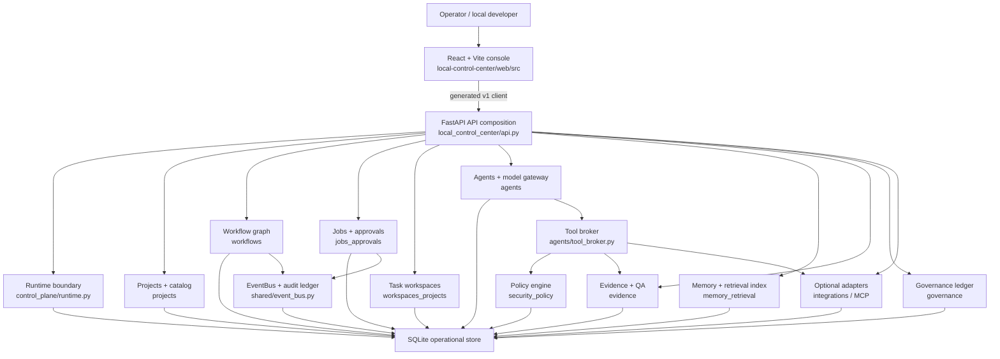

# AIDO Project Map

This is the maintained human map of the project. Use CodeGraph for fresh symbol
and impact queries, but keep its local SQLite index out of Git.



## Development Graph

CodeGraph is intentionally development-only. Keep the CLI installed outside the
product dependency graph. AIDO pins Node through `.nvmrc` to Node `24.16.0`,
which satisfies CodeGraph's current `>=20 <25` engine range without adding
CodeGraph to `dependencies` or `devDependencies`.

Use the repo Node version through NVM, then install or update the `codegraph`
CLI:

```powershell
powershell -NoProfile -ExecutionPolicy Bypass -File local-control-center/scripts/use-node.ps1
New-Item -ItemType Directory -Force .tmp | Out-Null
Invoke-WebRequest -UseBasicParsing https://raw.githubusercontent.com/colbymchenry/codegraph/main/install.ps1 -OutFile .tmp/codegraph-install.ps1
notepad .tmp/codegraph-install.ps1
powershell -NoProfile -ExecutionPolicy Bypass -File .tmp/codegraph-install.ps1
```

```powershell
corepack pnpm@10.24.0 run codegraph:init
corepack pnpm@10.24.0 run codegraph:index
corepack pnpm@10.24.0 run codegraph:status
corepack pnpm@10.24.0 run codegraph:files
```

The generated `.codegraph/` directory is ignored because it contains a local,
rebuildable SQLite index. Do not depend on it as product state.

## Source Topology

```text
local_control_center/
  api.py                         FastAPI v1 router composition
  cli.py                         Windows/local CLI entrypoint
  control_plane/                 runtime boundary and overview read model
  shared/                        DB, migrations, telemetry, time, JSON, events
  projects/                      project catalog and provider records
  workspaces_projects/           workspace discovery, allocation, Git worktrees
  jobs_approvals/                jobs, leases, approvals, action requests
  workflows/                     workflow definitions, runs, steps, edges
  security_policy/               command classification, policy, sandbox gates
  agents/                        profiles, tool broker, runtime adapters, models
  integrations/                  IDE and MCP registry surfaces
  memory_retrieval/              memory metadata and rebuildable retrieval index
  evidence/                      evidence packages, artifacts, QA verdicts
  governance/                    decisions, risks, next steps
  sessions_chats/                v1 session and chat read models
  pipelines/                     v1 pipeline read models
  prompts/                       prompt templates and versions

local-control-center/
  web/                           Vite + React + TypeScript console
  scripts/                       Windows operational scripts

tests_py/                        Python contract, architecture, policy tests
tests_web/                       Playwright dashboard smoke tests
docs/                            maintained architecture and operating docs
```
